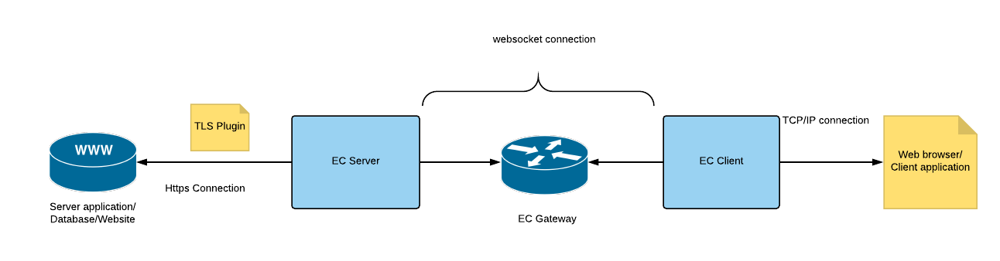

## TLS Plugin Deployment.
### TLS Plugin
Unlike the usual setup use cases for EC, the TLS plugin can be used in scenarios where the connectivity between the EC Server agent and the data-source has to be encrypted. The most common use case is connecting to an end point (data-source) using the "https" protocol over the port 443 instead of a regular "http" connection.

The plugin is always configured with the EC Server.

     
### Use case presented
Connecting to "www.salesforce.com" from the web browser in local system.
#### Requirements
1. Latest EC agent beta
2. Latest TLS plugin (with the plugin.yml configuration file)
3. manifest.yml and ec.sh configuration files to push EC Server and Gateway applications
4. EC Server + TLS Plugin and EC gateway on Cloud foundry (linux OS)
5. EC Client on local system (Windows 10 in the cited example. Usually same as the OS for local system)

### Plugin compatibility
TLS Plugin compatibility table
|           |   Build Number  |
| ----------|-----------------|
| Agent     |      #1221+     |
| Service   |      #1051+     |
| Plugin    |      #1231      |
### Setup Guide
#### Step 1. Prepare the essentials
1. Download / clone the [latest EC agent beta]("https://github.com/Enterprise-connect/ec-sdk/tree/beta") into your machine.
2. Unzip/ Extract the beta agent corresponding to your operating system.
3. Download / clone the [files required to push applications on Predix]("https://github.com/Enterprise-connect/ec-agent-cf-push-sample/tree/cd53150b6854879254cf9837f31cc0444af79705")
4. Download /clone the [latest version of the TLS plugin]("https://github.com/Enterprise-connect/ec-sdk/tree/beta/plugins")  
5. Create directories in the following pattern:
    *           EC
                |_ ec-gateway-agent
                                    |_ ecgaent_linux_sys
                                    |_ ec.sh
                                    |_ manifest.yml
                |_ ec_server_agent
                                    |_ ecgaent_linux_sys
                                    |_ ec.sh
                                    |_ manifest.yml
                                    |_ plugins.yml
                                    |_ tls_linux_sys
                 |_ ec-gateway-agent
                                    |_ ecgaent_OS_sys
                                    |_ ec.sh
                                    
Note : The plugin version has to match with that of the EC agent in the directory.

6. Open cmd as admin.
    \* Use VPN if you are outside the GE network in the case that proxies are configured.
7. Login to CF1 or CF3. 
8. Navigate to the directory of interest, where the EC agent and other essentials reside.

#### Step 2 The Predix UAA Service
To create an EC service, the Predix UAA service is of utmost importance.
You can choose to use an existing UAA instance or create a new one.
* Create a new UAA service:
``
cf create-service predix-uaa Free <anyServiceName> -c <anyflie>.json
``

where the .json file consists of the client secret for the UAA service instance in the following format.
> {"adminClientSecret":"<the password for your UAA>"}

Note: The JSON file should exist in the same directory you navigated to.

* Create a service-key for the UAA service using :
``
cf csk <uaa-service-name> <uaa-service-key-name>
``

Retrieve the information in the service key using
``
cf service-key <uaa-service-name> <uaa-service-key-name>
``

* Save the issuer ID of the UAA in a separate json file in the following format:
> {"trustedIssuerIds":["https://<issuerID-from-uaa-service-key>"]}

#### Step 3 Creating EC Service
You can either use an existing service or create a new EC service for this purpose.

To create a new service. 
`` 
cf create-service enterprise-connect Oneway-TLS <service-name> -c <json-with-issuerId-from-uaa>.json
``
where the json file resides in the folder you have navigated to, and contains the issuer ID from the UAA service-key

Create a service key for the EC service.

#### Step 3 UAA client creation.

Navigate to the dashboard URL given in the UAA service-key. 
    * The "uri" specified in the UAA service-key becomes the username
    * The adminClientSecret specified in the json file used to create the UAA service instance becomes the password.

Create/ Edit a UAA client. 
    * Remember the UAA client name and client secret.
    * Ensure the client_credentials and refresh_tokens are enabled.
    * Add the oauth_scope from the EC service-key to the "Authorities" field in the UAA client.
    * Save your settings.

Your EC service is now added to the UAA client and token exchange feature is enabled for the purpose of authentication.

#### Step 4. Pushing EC Gateway Application
* Ensure the ecgaent_linux_sys is in the corresponding directory you have navigated to.
* Edit the manifest.yml to contain the EC gateway application name.
* In the ec.sh file , edit the following command with corresponding credentials from the EC service-key
``
./ecagent_linux_sys \
-mod gateway \
-lpt ${PORT} \
-zon <Predix-Zone-ID in the EC service-key> \
-sst <EC-Service-URI> \
-tkn <admin-token>
``
* Comment the other commands and save the changes.
* Push the app onto predix from the cmd using the command
    `` cf push ``
* If you see the EC gateway status as "Running" , you are ready to proceed to the next step.
* Keep a note of the Gateway-URL
* [Enable Diego]("https://github.com/cloudfoundry-attic/Diego-Enabler") for the gateway application, as needed
* [Scale the gateway]("https://docs.cloudfoundry.org/devguide/deploy-apps/cf-scale.html") application based on the load you might need to handle

#### Step 5 Pushing the TLS plugin enabled EC Server 

* If the EC server needs to be pushed to CF, ensure you have the ecagent_linux_sys in your directory. If you want to run it on any other environment, ensure you have the EC agent corresponding to the OS of your platform/ system.
* Edit the manifest.yml to contain the EC server application name.
* In the ec.sh file , edit the following command with corresponding credentials from the EC service-key
``
    ./ecagent_os_sys 
            -mod server \
            [-grp <group-id>] \
            -aid <VCAP_provided/ service-key_provided EC "id"> \
            -cid <UAA_client_ID/UAA_client_name> \
            -csc <UAA_client_Secret> \
            -dur 1200 \
            -hst wss://<Predix_Gateway_App_URL>/agent \
            -oa2 https://<predixUAA_URL_in_ECService_key>/oauth/token \
            -zon <Predix-Zone-ID_in_ECService_key> \
            -sst <EC-Service-URI> \
            -rht localhost \
            -rpt <specified_by_you> \
            -hca ${PORT} \
            -plg tls \
            [-pxy "http proxy"]
``
Note: 
    * Please verify your network environment in order to decide whether the pxy (Proxy) makes sense for your agent deployment
    * If you are using the latest agent build#1233, you will need to enable the group ID in your configuratuons. In case you have not created a new group ID, you Zone ID becomes your group ID.
    * To know your group ID, use the following command in cmd.
    `` cf service <service-name> --guid ``
* Comment the other commands and save the changes.
* Ensure the directory contains the plugin.yml file and the plugin artefact, ``tls_os_sys`` of the same OS version as your EC agent.
* Edit the plugin.yml file and save
``
    ec-plugin:
  tls:
    status: active
    schema: https
    hostname: www.salesforce.com
    tlsport: "443"
    proxy: "<add if you have added in the EC server config"
    port: "<same as -rpt in server config "
    command: <./tls_os_sys>
``
* Push the app onto predix from the cmd using the command
    `` cf push ``
* If you see the EC server status as "Running" , you are ready to proceed to the next step.

#### Step 6. Running the EC client.

* Ensure you have the EC agent corresponding to the OS of your platform/ system.
* In the ec.sh file , edit the following command with corresponding credentials from the EC service-key. Run this command directly on your terminal/cmd
``
    ecagent_os_sys 
            -mod client \
            [-grp <group-id>] \
            -aid <cannot be same as server_ID> \
            -tid <-aid of server> \
            -cid <UAA_client_ID/UAA_client_name> \
            -csc <UAA_client_Secret> \
            -dur 1200 \
            -hst wss://<Predix_Gateway_App_URL>/agent \
            -oa2 https://<predixUAA_URL_in_ECService_key>/oauth/token \
            -lpt <Defined_by_you> \
            [-pxy "http proxy"]
``
Note: 
    * Please verify your network environment in order to decide whether the pxy (Proxy) makes sense for your agent deployment
    * If you are using the latest agent build#1233, you will need to enable the group ID in your configuratuons. In case you have not created a new group ID, you Zone ID becomes your group ID.
    * To know your group ID, use the following command in cmd.
    `` cf service <service-name> --guid ``

* If you see the EC client status as "Running" , you are ready to proceed to the next step.

#### Step 7. Verifying Connection
* Open the browser
* Try to navigate to the uri "localhost:<-lpt_value_from_client_config>"
* If you see the web page loading, your connection is verified. 

