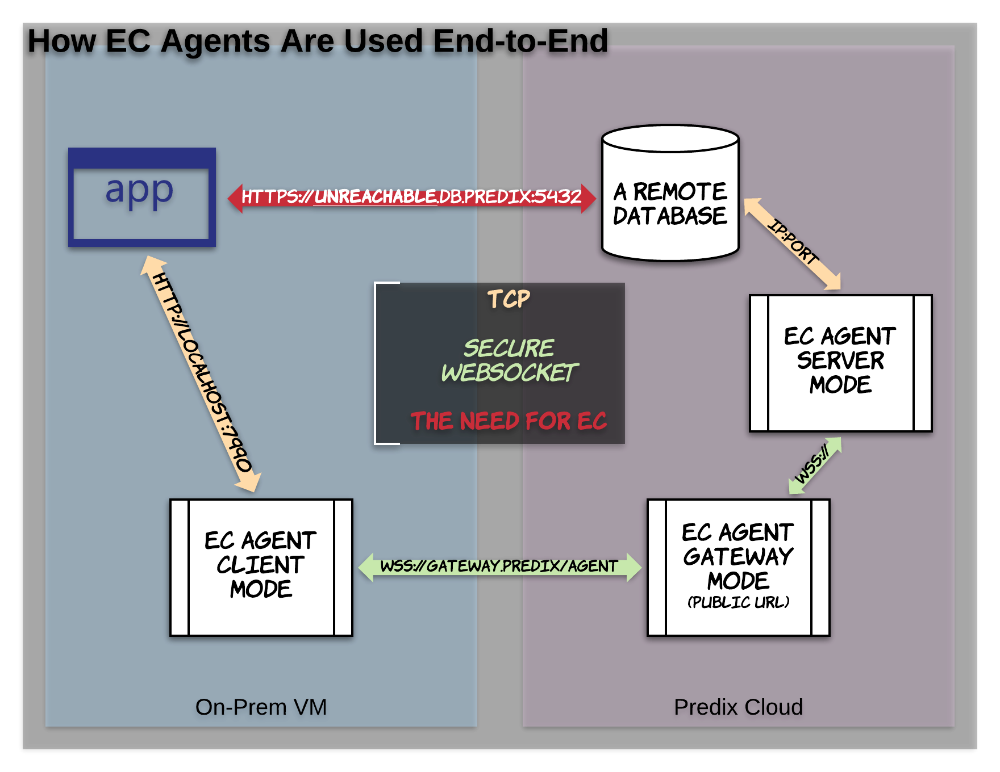

# Agents

This page is intended to explain the Enterprise Connect 'Agent', a [GoLang](https://golang.org/) binary capable of running on Linux, Windows and Mac systems, in five distinct [modes](./modes.md#what-are-modes).

* [Gateway](#gateway)
* [Server](#server)
* [Client](#client)
* [Fuse Modes](#fuse-modes)
* [Agent Binary](#agent-binary)
* [Deployment](#deployment)
* [Reference](#reference)
* [Pro Tips](#pro-tips)

 

---
---

## Gateway
The EC agent binary, running as a Gateway, is widely considered to be the 'core' of Enterprise Connect. Many users actually believe the Gateway **is** the Service itself, but that is actually not the case. 

EC Gateway operates as a hub with a publicly available URL. Without this, the EC Client and EC Server would have no way of referring to one another. If they could, you would not need EC! When an EC Client goes to make a connection (via secure web-socket to the EC Gateway) to a particular EC Server, the EC Gateway will use details about both, and verify the validity of these connections with the EC Service APIs. It makes sure that no connections are made using an EC Service that do not provide the most basic identification and authorizations. 


### Health
The EC Gateway, once running on Predix, will have a /health endpoint, which is probably the most powerful tool users have to self-diagnose and monitor their connectivity, a la *https://some-ec-gateway-app.run.some-subdomain.predix.io/health*

**Gateway Agent Key Flags**
- `tkn`: _A Basic authorization used to access certain EC Service APIs_
- `sst`: _The EC Service URI, to hit the correct APIs_

**Gateway Agent Example Script**
```bash
./ecagent_linux_sys \
-mod gateway \
# gpt should be 8080 or ${PORT} when pushing to Predix
-gpt $GPT \
-zon $ZON \
-sst $SST \
-tkn $TKN
```

> see ['Understanding Service Credentials'](./service-credentials.md#understanding-credentials) for an idea on how to populate these values. For a commented-template with all EC Agent Mode examples, and explanations of flags, see [our recommended templates](../reference/ec.sh).

## Server
The EC Server is primarily concerned with two things: the IP/hostname and PORT for the data source that is central to your use case. I.e., if your use case involves accessing a Postgres instance on Predix, it would know the hostname for that instance, as well as the port, which is typically 5432. 

When the EC Server is ran/started, it actively and immediately attempts to make a 'Super Connection' (full duplex, bidirectional data flow) with the EC Gateway using the EC Service APIs. Once established, this 'Super Connection' will be reflected in the JSON output of the EC Gateway's /health endpoint.

**Server Agent Key Flags**
- `aid`: _The EC Server **A**gent's **ID**_
- `rht`: _Resource hostname/IP_
- `rpt`: _Resource PORT_

**Server Agent Example Script**
```bash
./ecagent_linux_sys \
-mod server \
-aid $SERVER_ID \
-grp $GRP \
-cid $CID \
-csc $CSC \
-dur $DUR \
-oa2 $OA2 \
-hst $HST \
-zon $ZON \
-sst $SST \
-rht $RHT \
-rpt $RPT \
-hca $HCA
```

> see ['Understanding Service Credentials'](./service-credentials.md#understanding-credentials) for an idea on how to populate these values. For a commented-template with all EC Agent Mode examples, and explanations of flags, see [our recommended templates](../reference/ec.sh).

## Client
The Client is fairly lazy. When you tell it to run, it will! However, it just kind of sits there until something tries to access it via `127.0.0.1:${CHOSEN_PORT}`. Then and only then will it make any call to the EC Gateway or appropriate EC Server. The only things the EC Client really cares about is a PORT to listen on, and the 'id' of the EC Server you wish to reach. The rest of the configuration is background security minutiae. 

**Client Agent Key Flags**
- `aid`: _The EC Client **A**gent's **ID**_
- `tid`: _The **T**arget EC Server's **ID**_
- `lpt`: _The local PORT the EC Client listens on_

**Client Agent Example Script**
```bash
./ecagent_linux_sys \
-mod client \
-aid $CLIENT_ID \
-tid $SERVER_ID \
-grp $GRP \
-cid $CID \
-csc $CSC \
-dur $DUR \
-oa2 $OA2 \
-hst $HST \
-lpt $LPT
```

> see ['Understanding Service Credentials'](./service-credentials.md#understanding-credentials) for an idea on how to populate these values. For a commented-template with all EC Agent Mode examples, and explanations of flags, see [our recommended templates](../reference/ec.sh).

## Fuse Modes
There are two more EC Agent modes; where we 'fuse' the Gateway and Server, or the Gateway and Client. please see the [expanded documentation](./modes.md) to better understand the nuances of these modes.

[back to top](#agents)

## Agent Binary
Need the [latest Agent Binary](https://github.com/Enterprise-connect/ec-x-sdk/tree/v1/dist)? Clicking the links below will begin the download of the Agent Binary appropriate to run in that environment.

* [Linux](https://github.com/Enterprise-connect/ec-x-sdk/raw/v1/dist/ecagent_linux_sys.tar.gz)
* [Windows](https://github.com/Enterprise-connect/ec-x-sdk/raw/v1/dist/ecagent_windows_sys.exe.tar.gz)
* [Mac](https://github.com/Enterprise-connect/ec-x-sdk/raw/v1/dist/ecagent_darwin_sys.tar.gz)

Need an [older binary](https://github.com/Enterprise-connect/ec-sdk/commits/dist)? It may or may not be maintained/available. Consider [upgrading](./upgrades.md).

## Deployment
When deploying/running the EC Agent, there are two primary considerations to be made:

* [Where is the agent going to run?](#agent-binary)
* Does the agent need a proxy?

### Where?
While on paper, it may seem simple or obvious how to select the appropriate [EC Agent Binary](#agent-binary), many users get tripped up focusing on the OS they are running on their local machine - rather than the OS of the environment they deploy to. It's common enough to be chalked up to 'honest mistake'.

Consider the EC Agent running in [Gateway mode](#gateway). This is (almost) always ran in Predix / Cloud Foundry, and uses the Linux binary, **regardless if it was pushed to Cloud Foundry from a Windows, Mac, etc., machine**.

#### For Cloud Foundry

### Proxy?
Are you pushing to Cloud Foundry? Then it will not need proxy.

If it's running somewhere other than Cloud Foundry, does that shell/vm/etc have proxy ENVs, i.e., `$http_proxy`, `%HTTPS_PROXY%`, etc? If that is the case, the EC Agent will need to know this and provide this value. Here's how.

```bash
| => echo "$http_proxy"
http://cis-americas-pitc-cinciz.proxy.corporate.gtm.ge.com:80 # my proxy
```

We have at least two options to add this to our EC Agent script/command:

#### String Literal
Just copy and paste it right there, just as it appears as an ENV...
`-pxy http://cis-americas-pitc-cinciz.proxy.corporate.gtm.ge.com:80`

#### String Interpolation
Use the ENV itself!
`-pxy $http_proxy`

## Reference
You may find these files helpful in deploying and running agents (may download and/or view incorrectly from github.io page, see github.com in this case)

- [Agent Templates](../reference/ec.sh)
- [Working, Viable Manifest for Predix](../reference/manifest.yml)

### Pro Tips
- Consider using GitHub to make configuration changes in deployed agents
- We debug EC problems with logs in this order: EC Client, EC Gateway, EC Server. There is no database of deployed agent locations
- 'Messing with' proxies inside of an EC Agent script could produce bizarre behavior and connectivity issues	
```

[back to top](#agents)

[documentation home](https://enterprise-connect.github.io/documentation/) 
