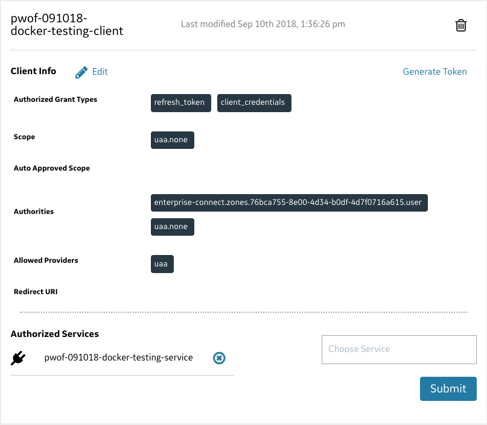

# User Account and Authentication
This page provides all information required to understand the use and configuration of [Predix UAA](https://www.predix.io/services/service.html?id=1172) for Enterprise Connect.

* [EC Service Creation](./subscription.md)
* [Client Creation](#client-creation)
* [Pro Tips](#pro-tips)

---
---

## Client Creation
After the creation of the EC Service, a [UAA Client](https://predix-toolkit.run.aws-usw02-pr.ice.predix.io/) must be provisioned and properly updated. This task can be accomplished through the UAA dashboard (see below) as well, if you prefer that over the [Predix Tool Kit](https://predix-toolkit.run.aws-usw02-pr.ice.predix.io/). While we are providing this explanation, please understand that Enterprise Connect is not directly affiliated with Predix UAA, and any technical issues regarding a UAA would need to be handled by the UAA team. If you need further assistance with UAA beyond what is explained here, please reach out to Predix or other relevant parties. This explanation is 'as-is'.

- 'Authorized Grant Types' must be updated to include 'client_credentials' and 'refresh_token'
- The name of the UAA Client, as well as the UAA Client 'secret', will be needed in configuring EC agent scripts
- The 'oauth-scope' from the EC Service [credentials](./service-credentials.md) to be added to the **Authorities** portion, **not the Scopes**
- Take note of the 'Token Validity' for your UAA Client - if altered from defaults, this will also be important in [EC Agent](./agents.md) configuration

While the presentation of data may vary depending on how you performed the UAA Client creation (there are more ways than we outline here), your final configuration should reflect something congruent to this Client's config/options:

## Next Steps
* [Retrieving Service Credentials](./service-credentials.md)
* [Deploying Agents](./agents.md)
 
### Pro Tips
- Shared-UAA works, but we have seen some teams struggle with delays stemming from a central admin approach

[back to top](#user-account-and-authentication)
[Documentation Home](https://enterprise-connect.github.io/documentation/)