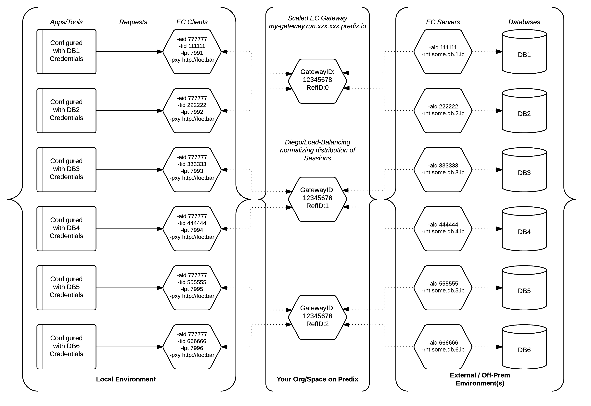
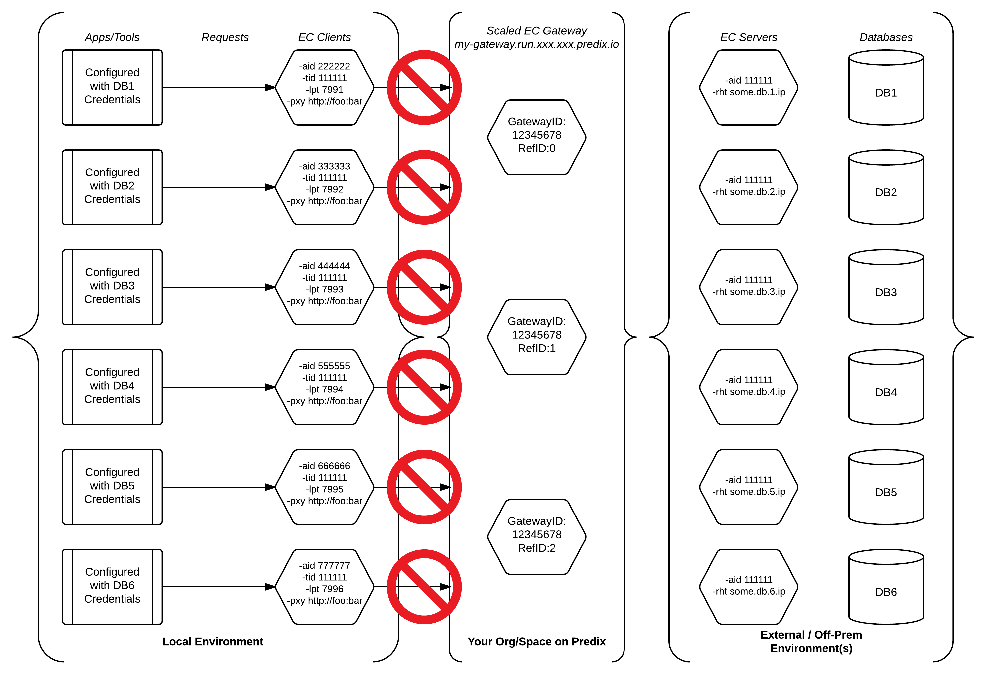

<A NAME="top">
    
# Comprehensive Guide to Enterprise Connect

* [Foreword](#foreword)
* [Service Creation](#service-creation)
* [UAA Client Update](#uaa-client-update)
* [Script Templates](#script-templates) 
* [Pushing Agents to Predix](#pushing-agents-to-predix) 
* [Diego, Scaling, and Managing Complex Use Cases](#diego-scaling-and-managing-complex-use-cases)
    * [Reusability of IDs](#reusability-of-ids)
* [FAQs](#faqs) 
* [Observed Problems and Resolutions](#observed-problems-and-resolutions) 
* [References and Further Resources](#references-and-further-resources)

## Foreword
This guide is to serve as a means, for users who are new to Enterprise Connect (EC), to gain a cursory understanding of how to set up EC and how EC should ultimately behave. It is important to understand that due to the multitude of moving parts, the security measures EC implements, and the lack of predictability and/or entropy of certain outside factors, that adherence to the steps outlined in this guide is absolutely crucial, to at the very least begin to isolate any connectivity issues that may arise.</br> 

For the clear and staggering majority of users, after a quality configuration is established, EC will hold up its end of the bargain and deliver consistent and stable connectivity between two remote entities. We strongly encourage that users submit, as "Issues", any problems they face using this guide or with EC in general, either to this repo or to our [SDK](https://github.com/Enterprise-connect/ec-sdk). This will notify our team and allow us to address the issue. If we deem this is a reasonably reproducable issue for other users that is not a result of faulty EC behavior, we will add this to our knowledge base here (FAQs, Problems/Resolutions below).

This guide also assumes (and suggests) a shell-centric approach. While there are web UIs available to acclomplish many of the tasks presented, we recommend using the [CloudFoundry CLI](https://docs.cloudfoundry.org/cf-cli/install-go-cli.html), as this will make your future as an Enterprise Connect expert much brighter. There is ample [CF CLI documentation and reference](https://docs.cloudfoundry.org/cf-cli/cf-help.html) available, but for the purpose of this guide, you will only need to utilize a few basic commands pertaining to apps and services.

## Service Creation
#### The Enterprise Connect Service requires a valid [UAA Instance](https://www.predix.io/services/service.html?id=1172) on Predix
Using the [CloudFoundry CLI](https://docs.cloudfoundry.org/cf-cli/install-go-cli.html), use the following command to view Services and Plans in CloudFoundry Marketplace:
```
cf m
```
Using the [CloudFoundry CLI](https://docs.cloudfoundry.org/cf-cli/install-go-cli.html), use the following command to create an EC Service Instance in your org and space:
```
cf create-service enterprise-connect <plan> <service instance name> -c <trusted issuer as a json or path to a json file>
```
The format for the trustedIssuerId JSON should be as follows:
```javascript
{"trustedIssuerIds":["https://<UAA URL>/oauth/token"]}
```
For best results, save the JSON to a file, and perform the EC creation command from that directory. The raw JSON may require escape characters if entered directly to the command line. Using a .json file circumvents this issue.</br></br>
#### Bind the EC Service to an App
To gain access to the important credentials related to your newly created service, EC must be bound to an app in your org/space. The app you choose is irrelevant. Using the [CloudFoundry CLI](https://docs.cloudfoundry.org/cf-cli/install-go-cli.html), use the following command to bind the EC Service to an app of your choice:
```
cf bind-service <app name> <EC Service name>
```
Using the [CloudFoundry CLI](https://docs.cloudfoundry.org/cf-cli/install-go-cli.html), use the following command to view the important credentials related to your service:
```
cf env <name of app you bound the EC Service to>
```
Navigate the JSON that is returned (later referred to as a 'VCAP') and find the portion reflecting the name of your EC Service. It is recommended that you copy everything starting from the word "credentials", and then paste this in a text document for reference, which will prove to be an invaluable time-saver while configuring your EC agent scripts. Documenting this information is also crucial in regards to knowledge transfers.</br></br>
<A HREF="#top">Back To Top</A>

## [UAA Client](https://predix-toolkit.run.aws-usw02-pr.ice.predix.io/) Update

#### After the creation of the EC Service, a [UAA Client](https://predix-toolkit.run.aws-usw02-pr.ice.predix.io/) must be provisioned and properly updated. This task can be accomplished through the UAA dashboard (see below) as well, if you prefer that over the [Predix Tool Kit](https://predix-toolkit.run.aws-usw02-pr.ice.predix.io/).
- 'Authorized Grant Types' must be updated to include 'client_credentials' and 'refresh_token'
- The name of the UAA Client, as well as the UAA Client 'secret', will be needed in configuring EC agent scripts
- Find 'oauth-scope' in the EC portion of the VCAP, and add this to the 'authorities' (not scope!) of the UAA Client 
- Take note of the 'Token Validity' for your UAA Client, this will also be important in EC agent configuration
</br></br>

#### Note about the UAA Dashboard:
The UAA Dashboard can be accessed at https://uaa-dashboard.run.YOUR.DOMAIN.predix.io/ </br></br>

<A HREF="#top">Back To Top</A>
## EC Agent Script Explanations and Templates
#### In the [next section](#pushing-agents-to-predix), we will discuss pushing EC agents to Predix. The purpose of this portion is to take a look at the EC agent scripts and explain some aspects of their usage. The following sections will guide your through configuring EC agent scripts as well as an implied directory structure. There is an [EC SDK](https://github.com/Enterprise-connect/ec-sdk) available to work from, but this repo comes with a lot of example code and may be a large or cumbersome download depending on your network connection speeds.
##### EC Gateway Agent
The EC Gateway should be the first agent you push and run.
```bash
./ecagent_linux_sys -mod gateway -lpt ${PORT} -zon <Predix-Zone-ID> -sst <EC-Service-URI> -tkn <admin-token> -dbg
```
Agents running on Predix will always require the [Linux agent binary](https://github.com/Enterprise-connect/ec-sdk/blob/dist/dist/ecagent_linux_sys.tar.gz), but other agents will require the appropriate binary based on the environment for your use case.
##### EC Server Agent
The EC Server should be the second agent you either push or run - and you will need the EC Gateway's URL to configure the EC Server and EC Client scripts. Once the EC Server agent is running, you will want to verify the 'super connection' with your Gateway, before moving onto pushing or running the EC Client.
```bash
./ecagent_OS_Version -mod server -aid <VCAP_provided> -cid <UAA_client_name> -csc <UAA_client_Secret> -dur 1200 -hst wss://<Predix_Gateway_App_URL>/agent -oa2 https://<predixUAA_URL>/oauth/token -zon <Predix-Zone-ID> -sst <EC-Service-URI> -rht <IP of data source> -rpt 5432 -dbg -hca ${PORT}
```
'${PORT}' will cause Predix to dynamically assign an available port. If ran elsewhere, '${PORT}' will need to be replaced with a port of your choice, which is not in use. Be sure the '-dur' flag used, which represents how often the agent will fetch a new token from the UAA in minutes, is lower/shorter than the 'Token Validity' values on your UAA Client (the agents need to refresh tokens before the UAA Client expires them). In the vast majority of cases, using the '-dur' value provided in these scripts will work well.
##### EC Client Agent
The EC Client should be the last agent your push or run, as it will have no functionality without the existence of a 'super connection' between the EC Gateway and EC Server agents.
```bash
./ecagent_OS_Version -mod client -aid <VCAP_provided> -tid <EC Server Agent '-aid'> -cid <UAA_client_name> -csc <UAA_client_Secret> -dur 1200 -hst wss://<Predix_Gateway_App_URL>/agent -oa2 https://<predixUAA_URL>/oauth/token -lpt <Defined_by_You> -dbg
```
##### Running Agents "Locally" with Relevant Binary
To run an agent, simply configure the appropriate script, and [download the binary](https://github.com/Enterprise-connect/ec-sdk/tree/dist/dist) appropriate to the environment. After extracting the agent to your working directory, simply paste your configured script in your CLI/shell. You can also save them as a script and run the script file. Agents not running on Predix require an additional proxy flag. You will need to identify what proxy is appropriate for your environment, and then add this flag to the end of the script:
```bash
-pxy <your proxy, no passwords allowed>
```
</br>
CLI/shell command to extract agents:
```bash
tar -xvzf path/to/the/ecagent_OS_sys.tar.gz
```
##### Simple Directory Structure
This is a good structure for keeping your agent configurations organized:
```
enterprise_connect
│   notes.txt               // very useful for maintain Service info
│   uaa.json          
│
└───ec_gateway
│   │   ec.sh
│   │   manifest.yml
│   │   ecagent_linux_sys
│
│   
└───ec_server
│   │   ec.sh
│   │   manifest.yml        // if running on Predix
│   │   ecagent_envOS_sys   // linux for Predix
│
│
└───ec_client
    │   ec.sh               
    │   manifest.yml        // if running on Predix
    │   ecagent_envOS_sys   // linux on Predix
```

<A HREF="#top">Back To Top</A>
## Pushing Agents to Predix
### Warning! The following instructions are absolutely critical to overall connectivity and behavior of the agents on Predix.
- You will need three items(<a href="https://github.com/Enterprise-connect/ec-agent-cf-push-sample/tree/dist" target="_blank">'ec.sh', 'manifest.yml'</a>, as well as the appropriate binary) to properly push an EC agent to Predix:
    1. a [file](https://github.com/Enterprise-connect/ec-agent-cf-push-sample/blob/dist/ec.sh) to start the agent binary with agent-mode specific flags, commonly named 'ec.sh'
    2. the Linux [binary](https://github.com/Enterprise-connect/ec-sdk/blob/dist/dist/ecagent_linux_sys.tar.gz)
    3. a [manifest.yml](https://github.com/Enterprise-connect/ec-agent-cf-push-sample/blob/dist/manifest.yml)
        - you will need to update the 'name:' field of the manifest to push your app, unless you choose to override that via command line
        - be mindful of the 'command:' field, if you choose to name rename 'ec.sh', this will need to be reflected here
        - please note the **'no-route'** option is set to **true**, this is necessary or will need to be overridden on the command line
- You will need to [add and install the Diego CF CLI plug-in](https://github.com/cloudfoundry-incubator/Diego-Enabler) with the commands found under installation
    - Run both commands, regardless of any perceived error after the first
- Pushing the EC Gateway agent to Predix first is highly recommended
    - Push the Gateway, then push/run Server, then push/run Client
    
#### Copy, paste, update, and utilize the following commands from the directory of your ec.sh, agent binary, and manifest.yml to push your app to predix
***Caution!*** If you are re-pushing an existing EC agent app, it is advised you begin with this command:
```bash
cf d -r -f <app name>
```
For a fresh app, or after you have deleted the previous app, use the following:
```bash
cf push
cf enable-diego <app name>
cf map-route <app name> <run.your.domain.predix.io> -n <app/route name>
```
You now have access to powerful features such as scaling(**not supported in Predix Select environment!**), allowing you to push a single Gateway app, and then scale it up - each Gateway instance able to handle 50 concurrent sessions! In fact, the EC team considers it best practice to scale your Gateway up to at least two instances:
```bash
cf scale <Gateway app name> -i 2
```
Other EC agents running on Predix may be scaled in the same manner. Interesting to note is that for some use cases, scaling the EC Server agent may mitigate the occurrence of connectivity errors caused by outside factors(network lag, timeouts, etc.).

<A HREF="#top">Back To Top</A>
## Diego, Scaling, and Managing Complex Use Cases
### (Scaling EC Agents on Select currently producing unexpected behavior!)
### Diego-enabled Agent Apps on Predix and Scaling
With the introduction, and requirement, of the [CloudFoundry CLI](https://docs.cloudfoundry.org/cf-cli/install-go-cli.html) [Diego plugin](https://github.com/cloudfoundry-incubator/Diego-Enabler) for all EC agents running on Predix, a powerful feature has been established. This update has provided our users the ability to *scale* their EC agents running on Predix (this can also be mimicked locally and manually) with a simple command:
```bash
cf scale <app name> -i <number of instances you want to scale to>
```
Users no longer need to be concerned with traffic to a Gateway requiring additional Gateways, Servers, Clients, etc. Each Gateway instance will provide *load-balanced* support for up to 50 concurrent sessions! The Gateway will employ machine learning to ensure that the traffic will be normalized across all instances of the Gateway. In other words, if you were to see 10 sessions on one instance of the Gateway, you should also see a number of sessions quite near that on the others.
### EC Usage with Multiple Data Sources and Client-side Applications
When you create an EC Service instance, you are provided with two IDs by default. These IDs are used to configure your Server and Client scripts, as discussed previously. This is only going to be adequate for very basic use cases and POCs. Many users new to EC are unaware of the expansive toolkit available at the Service URI. If you navigate to your Service URI, you can click 'API Docs' on the left nav-bar, at which point you will be prompted for a username and password. To obtain your credentials, find your admin token(*adm_tkn*) on your Service's VCAP, and [decode](https://www.base64decode.org/) this to view your credentials. For example:
> dXNlcm5hbWU6cGFzc3dvcmQ= </br>

... should decode to: </br>

> username:password </br>

#### GET admin/accounts/{group-id}
After obtaining your credentials and logging in, you will find a variety of APIs available to monitor and explore your Service. For the sake of this discussion, we will primarily focus on the *Accounts* family of APIs, which all require authorization in form of 'basic <adm_tkn>'. To view the current credentials for a Service, you can use the GET to /admin/accounts/{group-id}. By default, your 'group-id' will be the zone-id of the Service, which is conveniently located in the Service URI.
#### POST admin/accounts/{group-id}/add
The most empowering API in the *Accounts* family is the POST to admin/accounts/{group-id}/add. By providing the required authorization ('basic <adm_tkn>') and the 'group-id' (Service zone-id by default), you can use this API to generate additional IDs which can then be used to configure additional EC agent scripts.
#### Reusability of IDs
The IDs are capable of being reused, with some exceptions and limitations.
- When running multiple EC Servers simultaneously, there needs to be a 1:1 relationship between an ID used for the Server's *-aid* flag and the IP found in the Server's *-rht*
    - Running two identical Server scripts "locally" (or on a VM, etc) will mimick *scaling* as previously mentioned, and this is OK
- A single ID can be used for the *-aid* flag on multiple Clients simultaneously, provided each Client is assigned a different port (*-lpt*) to listen on, and the Client's *-tid* configuration is accurate
    - The Client uses the *-tid* flag to determine which Server, and ultimately which remote datasource, to access

#### ID Usage Example Diagrams
> Figure 1-a: EC Clients on prem reusing the same ID, this will be valid and functional


> Figure 1-b: EC Clients on prem needlessly using individual IDs, this will function but complicates things


> Figure 2-a: EC Servers are using duplicate IDs for different resources, this will not work

   
<A HREF="#top">Back To Top</A>
## FAQs

### Q: Does each Gateway require an EC subscription?
Pending an upcoming update, only one Gateway can be deployed at this time, but it can be scaled with Diego to multiple instances, allowing for the management of increased traffic volumes.

### Q: How much data and traffic can my EC Instance manage?
The EC Service instance is not concerned with the amount of data transferred. While we do recommend a separate EC instance for your 'prod' and 'non-prod' environments for the sake of isolation, there are tools and features that let one Service manage virtually "any" amount of traffic.
- You can scale your agents on Predix (including Gateways) with *cf scale app_name -i number_of_instances_desired*
    - Each Gateway instance can handle up to 50 concurrent sessions (Client-Server interactions)
- You can use the APIs in your Service URI to generate additional IDs beyond the two produced by default
    - You will need one ID per datasource IP, *-rht* flag on the Server. (1:1 ID:Servers)
    - You can use the same ID for all Client *-aid* flags, as long as you use different *-lpt* values and the *-tid* is configured for the correct Server (data source IP)
    
### Q: Are there any data bandwidth restrictions over EC?
No, Enterprise Connect does not set any limits on bandwidth usage.

<A HREF="#top">Back To Top</A>
## Observed Problems and Resolutions

### Problem: After scaling the Gateway, the previous connections keep failing
For our customers in Predix Select environments, Select is currently using a differentt API version (older, [2.62.0](https://apidocs.cloudfoundry.org/244/)) than Predix Basic ([2.75.0](https://apidocs.cloudfoundry.org/253/)). We believe this is the reason the agent behavior is different in Select; specifically, why we observe an inability to scale EC Gateways while maintaining connectivity.

If you are in Basic and having issues after scaling, please verify that you have followed all the steps related to enabling Diego in [Pushing Agents to Predix](#pushing-agents-to-predix). Afterwards, stop your EC Server(s), restart your EC Gateway, and then start your EC Server. If the problem still persists, please open a Predix Support ticket or reach out to us on Flowdock in our [EC Usergroup](https://www.flowdock.com/app/ge-developer-cloud/ec-usergroup) channel. If you haven't joined already, please consider [joining the EC Usergroup](https://www.flowdock.com/invitations/44765fcbae5a36d0eff83c9536f87223044ad748) to stay up-to-date on the the latest from the EC team, as well as contribute to, and beneifit from, engaging with our amazing community of users.

### Problem: '[EC Client] error while adding the client inst.'
This error occurs when the EC Client script is configured to connect to an invalid Gateway URL via the *-hst* flag, or when it tries to connect to through an EC Gateway with no active super connections.

### Problem: General connectivity (SuperConnection, etc) can be established but deteriorates immediately on end-to-end usage
While there are a variety of potential causes for this symptom, the most likely causes are:

- The EC agents running on Predix were not pushed properly, please see: [Pushing Agents to Predix](#pushing-agents-to-predix) 
- The EC agents are not running the same version of the binary, or outdated versions of the binary
    - While some old binary may work, the EC Service and the agents are not developed with backwards compatibility in mind, because this is a relatively new product, and there are countless improvements and features we plan on adding.
    - Because the agents all use the same core binary, regardless of their behavior based on the *-mod* flag, if one of the agents is using an older or newer version than the others, the interaction between them may become fundamentally flawed.
    - The Service requires an update to be compatible with current/recommended agents
- You have attempted to scale an EC Gateway in Predix Select, which is currently not supported due to the platform

### Problem: The Service is repeatedly crashing or failing in very consistent intervals
This is likely an issue with the relationship between your UAA Client and how often the Server and Client are fetching/refreshing tokens. While this is a fairly common source of support tickets, this is easily solved on the user's end by examining the *-dur* flag on your Server and Client. Please be sure the value used for this flag is less-than-half of the *Token Validity* values of your UAA Client. If you are unfamiliar with UAA Client management, one easy solution is to just make sure the value of the *-dur* flag on your Server and Client are "low" (i.e. 300, 600, 1200). *Note: it can take up to 15-20 minutes for a crashed Service to come back up via automation*

**The easiest way to verify this:**

Start up an EC Server or EC Client. After it starts up and reports the version, it will fetch a bearer token (which will be visible if the *-dbg* flag is enabled), and then it will print something out along these lines:

> [EC Client] 2017/10/31 09:28:51 Token refreshed. The token will be expired in ***x*** minutes. Approx. ***y*** minutes to the next auto-refresh

if (y >= x) { You are going to have issues };

### Problem: EC Server agent getting 404 trying to reach the EC Gateway
The solutions to this problem range from "simple fix" to a Predix Support ticket. The easiest and most likely causes are:
- Have you verified the EC Gateway is up and running?
- Does the *-hst* flag properly reflect the EC Gateway URL in the correct format?
    - *-hst wss://gateway-url/agent*
    
Beyond these simple fixes, if the 404 error is including the name of your current Gateway app/url, and you have pushed or updated this Gateway in the past, this could be due to the existence of "phantom" apps which were not properly deleted in Cloud Foundry. In such cases, only the Predix Support team has the tools and access to identify and correct such anomalies. In this event, they will need the 'gtwId's of the offending apps, which you can get from the Gateway list at the Service URI, or in the EC Server logs near the 404 message. They can use these Ids to find and properly destroy the bad Gateway apps.

<A HREF="#top">Back To Top</A>
## References and Further Resources

[Join the EC Usergroup on Flowdock!](https://www.flowdock.com/invitations/44765fcbae5a36d0eff83c9536f87223044ad748)</br>
[Enterprise Connect SDK](https://github.com/Enterprise-connect/ec-sdk)</br>
[Predix Tool Kit](https://predix-toolkit.run.aws-usw02-pr.ice.predix.io/)</br>
[CloudFoundry CLI](https://docs.cloudfoundry.org/cf-cli/install-go-cli.html)</br>
[CF CLI Docs](https://docs.cloudfoundry.org/cf-cli/)</br>
[Diego Enabler Plugin for CF CLI](https://github.com/cloudfoundry-incubator/Diego-Enabler)</br>
[Enterprise Connect page on Predix.io](https://www.predix.io/services/service.html?id=2184)</br>
[User Account and Authentication page on Predix.io](https://www.predix.io/services/service.html?id=1172)</br>

<A HREF="#top">Back To Top</A>