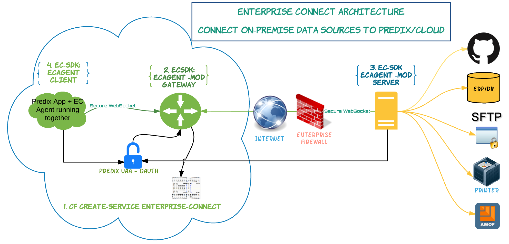
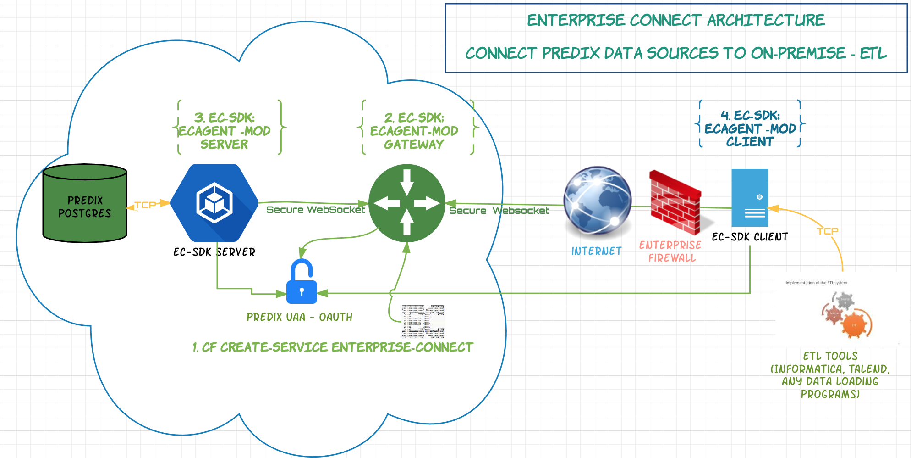

<A NAME="top">

# Comprehensive Guide to Enterprise Connect (EC)

* [Foreword](#foreword)
* [Caution!](#caution)
* [Common Use Cases](#common-use-cases)
* [Service Creation](#service-creation)
* [UAA Client Update](#uaa-client-update)
* [EC Agency](#ec-agency) 
* [Agent Scripts and Running Agents](#agent-scripts-and-running-agents) 
* [Diego, Scaling, and Managing Complex Use Cases](#diego-scaling-and-managing-complex-use-cases)
    * [Reusability of IDs](#reusability-of-ids)
* [FAQs](#faqs)
* [Observed Problems and Resolutions](#observed-problems-and-resolutions) 
* [CF CLI Quick Reference for EC](#cf-cli-quick-reference-for-ec) 
* [References and Further Resources](#references-and-further-resources)

## Foreword

Enterprise Connect ('EC') is a software-based solution to very common network environment challenges. It allows those familiar with the configuration to connect to a remote resource from 'on-prem', and vice versa, in a matter of minutes - without ever having to touch ports, firewalls, et cetera! It is 100% software. While Enterprise Connect is a Predix Service at the core, it is more well known by its 'agent', a binary that can run as an app, in three distinct modes, which will be explained in detail later.</br> 

This guide is the entry point for those new to Enterprise Connect, and can also serve to refresh the memory of those who may have not configured Enterprise Connect recently - we are always developing and refining script-flags, usage and features!</br> 

Finally, this guide assumes (and recommends!) a shell or command line approach. While there are web UIs available for some of the tasks presented, we recommend using the [CloudFoundry CLI](https://docs.cloudfoundry.org/cf-cli/install-go-cli.html) as much as possible, as this will make your future as an Enterprise Connect expert much brighter - and not to mention our support is 100% shell-based. There is ample [CF CLI documentation and reference](https://docs.cloudfoundry.org/cf-cli/cf-help.html) available, but for the purpose of this guide and most of Enterprise Connect, you will only need to utilize a few basic commands which you will be able to, for the most part, copy and paste.</br> 

## Common Use Cases

> Predix to On-Premises Data Source </br>
 

> On-Premises to Predix Data Source </br>



## Service Creation
#### The Enterprise Connect Service requires a valid [UAA Instance](https://www.predix.io/services/service.html?id=1172) on Predix
Using the [CloudFoundry CLI](https://docs.cloudfoundry.org/cf-cli/install-go-cli.html), use the following command to view info about the Enterprise Connect Service:
```bash
cf m -s enterprise-connect
```
Using the [CloudFoundry CLI](https://docs.cloudfoundry.org/cf-cli/install-go-cli.html), use the following command to create an EC Service Instance in your org and space:
```bash
cf create-service enterprise-connect Oneway-TLS <name the service> -c <trusted issuer json, see below>
```
**Format the trusted issuer JSON as follows:**
```javascript
{"trustedIssuerIds":["https://<UAA URL>/oauth/token"]}
```
This can get unduly tricky with escape characters. If you are working out of a relevant directory, i.e., 'my-enterprise-connect-configuration/', you can just save the trusted issuer as a JSON file, and then simply reference that file in the CF create-service command.
```bash
cf create-service enterprise-connect Oneway-TLS <name the service> -c oauth.json
```

### Get the EC Service Credentials via 'Service Key'
Using the [CloudFoundry CLI](https://docs.cloudfoundry.org/cf-cli/install-go-cli.html), use the following command to create a Service Key:
```
cf create-service-key <EC Service name> <a name for the Service Key>
```
After creating a Service Key, use this command to view the EC credentials:
```
cf service-key <EC Service name> <Service Key name>
```

This should return something along these lines (ENVs/'VCAP'):

```javascript
{
 "ec-info": {
  "adm_tkn": "YWRtaW46c2VjcmV0",
  "ids": [
   "q1w2e3",
   "r4t5y6"
  ],
  "trustedIssuerIds": [
   "https://my-predix-uaa-guid.predix-uaa.run.aws-usw02-pr.ice.predix.io/oauth/token"
  ]
 },
 "service-uri": "https://12345678-abcd-1234-abcd-12345678abcd.run.aws-usw02-pr.ice.predix.io/v1beta/index/",
 "usage-doc": "https://github.com/Enterprise-connect/ec-misc-docs",
 "zone": {
  "http-header-name": "Predix-Zone-Id",
  "http-header-value": "12345678-abcd-1234-abcd-12345678abcd",
  "oauth-scope": "enterprise-connect.zones.12345678-abcd-1234-abcd-12345678abcd.user"
 }
}
```
Please copy and paste this information to a document you can readily access for upcoming configurations, preferably in a working directory holding all documents related to this setup and configuration.

#### Document Check! Are these recorded?
- use case / need for Enterprise Connect Service Instance
- Predix UAA Instance details
    - UAA Instance URI
    - UAA Admin/contact
- Enterprise Connect Service Intstance details
    - Predix Org and Space
    - Name
    - Who created?
    - Service Key

</br></br>
<A HREF="#top">Back To Top</A>

## [UAA Client](https://predix-toolkit.run.aws-usw02-pr.ice.predix.io/) Update

#### After the creation of the EC Service, a [UAA Client](https://predix-toolkit.run.aws-usw02-pr.ice.predix.io/) must be provisioned and properly updated. This task can be accomplished through the UAA dashboard (see below) as well, if you prefer that over the [Predix Tool Kit](https://predix-toolkit.run.aws-usw02-pr.ice.predix.io/). While we are providing this explanation, please understand that `EC != UAA`. If you need further assistance with UAA beyond what is explained here, please reach out to Predix or other relevant parties. This explanation is 'as-is'.
- 'Authorized Grant Types' must be updated to include 'client_credentials' and 'refresh_token'
- The name of the UAA Client, as well as the UAA Client 'secret', will be needed in configuring EC agent scripts
- The 'oauth-scope' from the Service Key / ENVs needs to be added to the **Authorities** portion, **not the Scopes**
- Take note of the 'Token Validity' for your UAA Client, this will also be important in EC agent configuration
</br></br>

#### Note about the UAA Dashboard:
The UAA Dashboard can be accessed at https://uaa-dashboard.run.PREDIX_SUBDOMAIN.predix.io/ 

#### Document Check! Are these recorded?
- use case / need for Enterprise Connect Service Instance
- Predix UAA Instance details
    - UAA Instance URI
    - UAA Admin/contact
- Predix UAA Client details
    - Name
    - 'Secret'
    - Configuration (state of all settings previously mentioned)
- Enterprise Connect Service Intstance details
    - Predix Org and Space
    - Name
    - Who created?
    - Service Key
</br></br>

<A HREF="#top">Back To Top</A>
## EC Agency
It is understood that human beings can identify, understand and remember something better when presented with behaviors versus abstract, technical facts. In this section, we hope to preface the coming technical configuration pieces with a 'behavioral' look at how the EC Agent operates in its three distinct modes: Gateway, Server, and Client.

### EC Agent as a 'Gateway'
The EC agent binary, running as a Gateway, is widely considered to be the 'core' of Enterprise Connect, so much so that many users actually believe the Gateway **is** the Service itself, but that is actually not the case. 

The EC Gateway runs as a hub, and when an EC Client goes to make a connection to a particular EC Server, the EC Gateway will use details about both, and verify the validity of these connections with the EC Service APIs. It makes sure that no connections are made using an EC Service that do not provide the most basic identification and authorizations. 

The EC Gateway, once running on Predix, will have a /health endpoint, which is probably the most powerful tool users have to self-diagnose and monitor their connectivity. Expert and seasoned users oftentimes set up various automated jobs and scripts to access this endpoint, and use the values therein to maintain good connectivity, and spot anomalies before they become problems. More on such anomalies and their root causes later.

**Gateway Agent Key Flags**
- `tkn`: _A Basic authorization used to access certain EC Service APIs_
- `sst`: _The EC Service URI, to hit the correct APIs_

### EC Agent as a 'Server'
The EC Server, while having a *visually* larger configuration, is actually only concerned with two things: the IP/hostname and PORT for the data source that is central to your use case. I.e., if your use case involves accessing a Postgres instance on Predix, it would know the hostname for that instance, as well as the port, which is typically 5432. 

When the EC Server is ran/started, it actively and immediately attempts to make a 'Super Connection' (full duplex, bidirectional) with the EC Gateway using the EC Service APIs (Bearer/oauth2, more later). Once this is accomplished, we will be able to see this connection reflected at the /health endpoint for the Gateway. After that, it will wait for connections from the EC Client, mediated by the EC Gateway. 

**Server Agent Key Flags**
- `aid`: _The EC Server **A**gent's **ID**_
- `rht`: _Resource hostname/IP_
- `rpt`: _Resource PORT_

### EC Agent as a 'Client'
The EC Client also has a rather *visually* large configuration, and like the other two modes, the bulk of this is background security stuff. Also, the Client is fairly lazy. When you tell it to run, it will! However, it just kind of sits there until something tries to access it via `127.0.0.1:${CHOSEN_PORT}`. Then and only then will it make any call to the EC Gateway or appropriate EC Server. The only things the EC Client really cares about is a PORT to listen on, and the 'id' of the EC Server you wish to reach. As mentioned previously, the rest of the configuration is background/security minutiae. 

**Client Agent Key Flags**
- `aid`: _The EC Client **A**gent's **ID**_
- `tid`: _The **T**arget EC Server's **ID**_
- `lpt`: _The local PORT the EC Client listens on_

</br> 

<A HREF="#top">Back To Top</A>
## Agent Scripts and Running Agents

### Agent templates
The [EC agent templates](https://github.com/Enterprise-connect/ec-agent-cf-push-sample/blob/dist/ec.sh) we provide in our [cf push example repo](https://github.com/Enterprise-connect/ec-agent-cf-push-sample) are essentially pre-written scripts for the three distinct agent modes: Gateway, Server, and Client. However, these are not absolute or all-inclusive. These are simply the *most basic*, functioning examples for each EC agent mode. 
    
If you have been following along linearly to this point, you should have access to every value described in those templates. Additionally, at the bottom of [ec.sh](https://github.com/Enterprise-connect/ec-agent-cf-push-sample/blob/dist/ec.sh) you will find a slightly modified 'flag map' which explains the meaning behind every flag/value in the templates, as well as additional, optional flags not being used or always needed.

### Agent binary
Once you configure the appropriate files (ec.sh for local/VMs, ec.sh and manifest.yml for Predix deployment), all that is left is to put the appropriate binary in the directory. 

>It is worth pointing out that the file-based approach is simply for documentation and convenience. You can manually enter, character-by-character, an EC agent binary command and all of the flags everytime you want to run the agent, but that's rather absurd, right? You can copy and paste the commands from a file, but again, why? It is, generally speaking, better to simply work out of a file. A support call that relies on vi tends to take at least twice as long, especially when you factor in being #skyped and the ubiquitous 'can you see my screen? is it showing?'. Text editors, please. 

You can find the [appropriate binary](https://github.com/Enterprise-connect/ec-sdk/tree/dist/dist) in our SDK. Select the 'sys' or 'sys.exe' relevant to the OS where the agent will run. Not necessarily YOUR OS. For instance, Windows users pushing an EC agent to Predix would not use the 'ecagent_windows_sys.exe' binary, as Predix runs Linux, not Windows.

### Summary
By this point, you might have something resembling the example below. I have gone a little bit overboard with the layout, but that is to err on the side of caution. While excessive, the below file structure is one example of a very self-evident file structure (unless viewing on mobile, sorry about that), which eases knowledge transfers and maintainability.


```bash
my-enterprise-connect-configuration-documentation
│   notes.txt              # worksheet/notes        
│   uaa.json               # our oauth/uaa json for service creation
│
└───ec_gateway
│   │   ec.sh               
│   │   manifest.yml       # apps on Predix 'need' a manifest
│   │   ecagent_linux_sys  # Gateway 'always' runs on Predix/Linux
│
│   
└───ec_server
│   │   ec.sh
│   │   manifest.yml        # if running on Predix
│   │   ecagent_some_dist   # Linux for Predix
│
│
└───ec_client
    │   ec.sh               
    │   ecagent_some_dist   # Be sure the ecagent distribution matches the OS where the agent will run (Windows, Darwin, Linux, etc)
```

At this point, you should be able to move into the appropriate directory, execute the relevant script and binary, or run a `cf push` command to deploy to Predix, and be all set for end-to-end connectivity. Don't forget to document!

</br></br> 

<A HREF="#top">Back To Top</A>
## Diego, Scaling, and Managing Complex Use Cases

### Diego-enabled Agent Apps on Predix and Scaling
Now that Diego is the default architecture on CF1, pushing EC Agent apps has become much simpler while giving users better flexibility to manage different use cases. This update has provided our users the ability to *scale* their EC agents running on Predix (this can also be mimicked locally and manually) with a simple command:
```bash
cf scale <app name> -i <number of instances you want to scale to>
```
Users no longer need to be concerned with traffic to a Gateway requiring additional Gateways, Servers, Clients, etc. Each Gateway instance will provide *load-balanced* support for up to 50 concurrent sessions! If you were to see 10 sessions on one instance of the Gateway, you should also see a number of sessions quite near that on the others.

### EC Usage with Multiple Data Sources and Client-side Applications
When you create an EC Service instance, you are provided with two IDs by default. These IDs are used to configure your Server and Client scripts, as discussed previously. This is only going to be adequate for very basic use cases and POCs. Many users new to EC are unaware of the expansive toolkit available at the Service APIs. If you navigate to your Service URI, you can click 'API Docs' on the left nav-bar, at which point you will be prompted for a username and password. To obtain your credentials, find your admin token(*adm_tkn*) on your Service's VCAP, and [decode](https://www.base64decode.org/) this to view your credentials. For example:
> dXNlcm5hbWU6cGFzc3dvcmQ= </br>

... should decode to: </br>

> username:password </br>

#### GET admin/accounts/{group-id}
After obtaining your credentials and logging in, you will find a variety of APIs available to monitor and explore your Service. For the sake of this discussion, we will primarily focus on the *Accounts* family of APIs, which all require authorization in the form of 'basic <adm_tkn>'. To view the current credentials for a Service, you can use the GET to /admin/accounts/{group-id}. By default, your 'group-id' will be the zone-id of the Service, which is conveniently located in the Service URI.

#### POST admin/accounts/{group-id}/add
The most empowering API in the *Accounts* family is the POST to admin/accounts/{group-id}/add. By providing the required authorization ('basic <adm_tkn>') and the 'group-id' (Service zone-id by default), you can use this API to generate additional IDs which can then be used to configure additional EC agent scripts.

#### Reusability of IDs
The IDs are capable of being reused, with some exceptions and limitations.
- When running multiple EC Servers simultaneously, there needs to be a 1:1 relationship between an ID used for the Server's *-aid* flag and the IP found in the Server's *-rht*
    - Running two identical Server scripts "locally" (or on a VM, etc) will mimick *scaling* as previously mentioned, and this is OK
- A single ID can be used for the *-aid* flag on multiple Clients simultaneously, provided each Client is assigned a different port (*-lpt*) to listen on, and the Client's *-tid* configuration is accurate
    - The Client uses the *-tid* flag to determine which Server, and ultimately which remote datasource, to access

#### ID Usage Example Diagrams
> Figure 1-a: EC Clients on prem reusing the same ID, this will be valid and functional


> Figure 1-b: EC Clients on prem needlessly using individual IDs, this will function but complicates things


> Figure 2-a: EC Servers are using duplicate IDs for different resources, this will not work

   
<A HREF="#top">Back To Top</A>
## FAQs

### Q: Does each Gateway require an EC subscription?
Pending an update, only one Gateway can be deployed at this time, but it can be scaled with Diego to multiple instances, allowing for the management of increased traffic volumes.

### Q: How much data and traffic can my EC Instance manage?
The EC Service instance is not concerned with the amount of data transferred. While we do recommend a separate EC instance for your 'prod' and 'non-prod' environments for the sake of isolation, there are tools and features that let one Service manage virtually "any" amount of traffic.
- You can scale your agents on Predix (including Gateways) with *cf scale app_name -i number_of_instances_desired*
    - Each Gateway instance can handle up to 50 concurrent sessions (Client-Server active, in-flight connections)
- You can use the APIs in your Service URI to generate additional IDs beyond the two produced by default
    - You will need one ID per datasource IP, *-rht* flag on the Server. (1:1 ID:Servers)
    - You can use the same ID for all Client *-aid* flags, as long as you use different *-lpt* values and the *-tid* is configured for the correct Server (data source IP)
    
### Q: Are there any data bandwidth restrictions over EC?
No, Enterprise Connect does not set any limits on bandwidth usage.

<A HREF="#top">Back To Top</A>
## Observed Problems and Resolutions

### Problem: My database connection is failing or intermittent, I believe EC is failing
Typically, when there is a problem with EC, you will have no connectivity whatsoever. You will not be able to login to a DB via PG Admin, or anything of the sort. If you have some connectivity but scripts and/or batch jobs are failing to complete - be sure to check for locks on processes within the DB itself. If the connectivity is strong for 'a while', but then begins to deteriorate or fail, please take a look at your Gateway /health. If you see active 'sessions' when there should be no activity (ie, `client pool == 0 || client pool < session count`), this is why your connectivity begins to fail, and it's because the application is not sending/signaling an `EOF`. Example:
```psql
psql << EOF
\copy (select * from dummy_data limit 100) to 'dummy_data.csv' csv;
\q
EOF
```
### Problem: After scaling the Gateway, the previous connections keep failing
Stop your EC Server(s), restart your EC Gateway, and then start your EC Server. If the problem still persists, please open a Predix Support ticket or reach out to us on Flowdock in our [EC Usergroup](https://www.flowdock.com/app/ge-developer-cloud/ec-usergroup) channel. If you haven't joined already, please consider [joining the EC Usergroup](https://www.flowdock.com/invitations/44765fcbae5a36d0eff83c9536f87223044ad748) to stay up-to-date on the the latest from the EC team, as well as contribute to, and beneifit from, engaging with our amazing community of users.

### Problem: '[EC Client] error while adding the client inst.'
This error occurs when the EC Client script is configured to connect to an invalid Gateway URL via the *-hst* flag, or when it tries to connect to an EC Server through an EC Gateway with no active super connections matching that Server's `-aid` value.

### Problem: General connectivity (SuperConnection, etc) can be established but deteriorates immediately on end-to-end usage
While there are a variety of potential causes for this symptom, the most likely causes are:

- The EC agents are not running the same version of the binary, or outdated versions of the binary
- The Service requires an update to be compatible with current/recommended agents
- You have attempted to scale an EC Gateway in Predix Select, which is currently not supported due to the platform

### Problem: The Service is repeatedly crashing or failing in very consistent intervals
This is likely an issue with the relationship between your UAA Client and how often the Server and Client are fetching/refreshing tokens. While this is a fairly common source of support tickets, this is easily solved on the user's end by examining the *-dur* flag on your Server and Client. Please be sure the value used for this flag is less-than-half of the *Token Validity* values of your UAA Client. If you are unfamiliar with UAA Client management, one easy solution is to just make sure the value of the *-dur* flag on your Server and Client are "low" (i.e. 300, 600, 1200). *Note: it can take up to 15-20 minutes for a crashed Service to come back up via automation*

**The easiest way to verify this:**

Start up an EC Server or EC Client. After it starts up and reports the version, it will fetch a bearer token (which will be visible if the *-dbg* flag is enabled), and then it will print something out along these lines:

> [EC Client] 2018/9/31 25:61:00 Token refreshed. The token will be expired in ***x*** minutes. Approx. ***y*** minutes to the next auto-refresh

if (y >= x) { You are going to have issues };

### Problem: EC Server agent getting 404 trying to reach the EC Gateway
The solutions to this problem range from "simple fix" to a Predix Support ticket. The easiest and most likely causes are:
- Have you verified the EC Gateway is up and running?
- Does the *-hst* flag properly reflect the EC Gateway URL in the correct format?
    - *-hst wss://gateway-url/agent*
    
Beyond these simple fixes, if the 404 error is including the name of your current Gateway app/url, and you have pushed or updated this Gateway in the past, this could be due to the existence of "phantom" apps which were not properly deleted in Cloud Foundry. In such cases, only the Predix Support team has the tools and access to identify and correct such anomalies. In this event, they will need the 'gtwId's of the offending apps, which you can get from the Gateway list at the Service URI, or in the EC Server logs near the 404 message. They can use these Ids to find and properly destroy the bad Gateway apps.

<A HREF="#top">Back To Top</A>
### CAUTION! 
#### 'Document Everything, Every Time: An Anecdotal Tirade Born of Good Intentions'

It stands to reason that the Enterprise Connect team and Predix Support cannot know what someone wrote in a file on their computer. We do not readily know who subscribed to, or 'owns', the Enterprise Connect subscription (without investigative work). It is your responsibility to document your use cases, configurations, and everything else. Conservatively estimating, something around 10% of support time is spent doing superflous investigative work resulting from a lack of documentation of initial configuration(s) - but ALSO resulting from our failure to adequately impress upon users the importance of documentation! (Which is why this warning is so opinionated and verbose!)

> Imagine your production environment is down, and you reach out to us or Predix Support, and we need to view a UAA configuration, but you do not know who the UAA admin is, or which UAA client you were using. Your prod environment will stay down until that is figured out. This is unfortunately common. Please, please, please... document **everything**.

Additionally, it is altogether too common that the teams and team-of-teams we work with have internal communication breakdowns. Sometimes, while resolving one developer's issue, we create a problem for another developer - simply because those developers were not adequately **communicating and documenting** changes made to one another. If 10 people across two teams are using the same Enterprise Connect subscription, everyone needs to be on the same page. Due to the amount of security involved with Enterprise Connect's end-to-end connectivity, it is by design that configurations are easily broken and will fail authorization checks. 

These are the most common items requested from our side and from Predix Support to help resolve issues:

- URI of the EC Service, location explained in this guide
- Gateway, Server and Client logs with corresponding/relevant time stamps - `cf logs my-app` 
- UAA Client configuration

Issues are rarely resolvable without these pieces. Only you can prevent Support Fires - through documentation! 
</br> 

<A HREF="#top">Back To Top</A>
## CF CLI Quick Reference for EC

<A HREF="#top">Back To Top</A>
## References and Further Resources

[Join the EC Usergroup on Flowdock!](https://www.flowdock.com/invitations/44765fcbae5a36d0eff83c9536f87223044ad748)</br>
[Enterprise Connect SDK](https://github.com/Enterprise-connect/ec-sdk)</br>
[Predix Tool Kit](https://predix-toolkit.run.aws-usw02-pr.ice.predix.io/)</br>
[CloudFoundry CLI](https://docs.cloudfoundry.org/cf-cli/install-go-cli.html)</br>
[CF CLI Docs](https://docs.cloudfoundry.org/cf-cli/)</br>  
[Enterprise Connect page on Predix.io](https://www.predix.io/services/service.html?id=2184)</br>
[User Account and Authentication page on Predix.io](https://www.predix.io/services/service.html?id=1172)</br>

<A HREF="#top">Back To Top</A>
