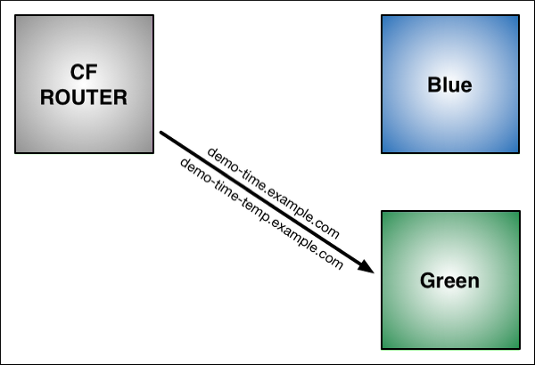
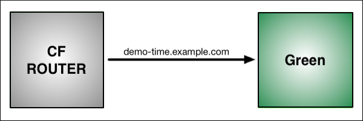

<A NAME="top">   
# Blue-Green Service Upgrade Process for Users

## Purpose

This document is designed to provide insight into the Enterprise Connect (EC) team's process for upgrading EC Services. It is not intended to provide a deeply technical understanding, but rather a means for EC users to understand, and be comfortable with, what they can expect through the process.

   
 

## "Blue-Green" Deployment

We use a [Blue-Green](https://docs.cloudfoundry.org/devguide/deploy-apps/blue-green.html) approach in our upgrade process. In simple terms, this means that we preserve the initial, "base" iteration of your EC Service to provide you with time to test the upgraded iteration. This is done through the use of temporary routes. When you are satisfied with the behavior of the newly created, upgraded iteration of your EC Service, we will finalize the upgrade, the temporary route and the old EC Service will be deleted, and the upgrade EC Service will be available at the original route.

  
 

#### Example "Starting" State:
There is one EC Service, and one route.

   
 

#### After Step 1, two EC Services exist:
There are now two EC Services, and two routes, with the new EC Service using a temporary route.

<A NAME="step1">

   
 

#### Step 2.1
After the user indicates their satisfaction with the upgraded iteration of the EC Service, we will begin to perform Step 2. The image below shows how the original route is mapped to the new EC Service, in addition to it still being mapped to the original.

   
 

#### Step 2.2
After the original route is mapped to the new EC Service, it is then un-mapped from the original EC Service.

   
 

#### Finalized
When Step 2 is fully completed, only the new EC Service and the original route will remain. At this point, any Gateways that had been testing the new EC Service via the temporary route will need to be re-pushed with a script reflecting the return to the original route.

<A HREF="#top">Back To Top</A>

   
 

## Requirements

The only thing the EC team needs to begin the process is the Predix zone ID of your EC Service. This can be found in several places, including the ENVs of an app you bound the EC Service to, a Service Key you create for your EC Service, as well as the EC agent Gateway script. You can also run this command, using the [Cloud Foundry CLI](https://github.com/cloudfoundry/cli) while logged into the org and space where the EC Service resides: `cf service <service name> --guid`. This will return the GUID/Zone-ID of the EC Service. 

Additionally, some users may not feel the need to test their upgrade, and may instead wish to forego the benefits and assurances that provides. For instance, if a user has a 'prod' and 'non-prod' EC Service, they may wish to limit their testing to just the 'non-prod' EC Service, and during that time prepare the files for both EC Services. This is not the only scenario in which someone may want to quickly perform both steps in the Blue-Green process, but it is one relatively common example. Due to the temporary route that is created for the upgraded EC Service, testing the EC Service brings with it a need to reconfigure scripts. While this is not greatly time consuming, it would result in downtime for production environments. Isolating that testing to a 'non-prod' environment mitigates that downtime.

<A HREF="#top">Back To Top</A>

   
 

## Getting Started

If you are ready to have your EC Service(s) upgraded, it's time to let us know! Please provide us with the following information to make the process as smooth as possible. 

  
  

### Service Info:
Please provide the URL for the EC Service(s), this will supply both the Zone ID and the domain for the EC Service.

  
 

### Step Info:
Please let us know what step(s) you are trying to have performed. Is your intention to test after <A HREF="#step1">Step 1</A> has been completed, or are you comfortable due to your experience with another upgrade and want Steps 1 and 2 performed in succession, without input from your side? We will always try to err on the side of caution if there is a lack of clarity here.

  
 

### Points of Contact:
Who needs to be notified on progress and updates? Please provide the emails, or other contact info, for any parties you wish to be kept informed during the upgrade process. We will be sure to oblige.

    
   

Once you have this information together, you can reach us at the following emails, or on Flowdock, or on Skype for Business, or just stopping by our desks!   
chia.chang@ge.com   
lauren.small@ge.com   
perrin.lake1@ge.com   
philip.wofford@ge.com   
prasad.alokam@ge.com   